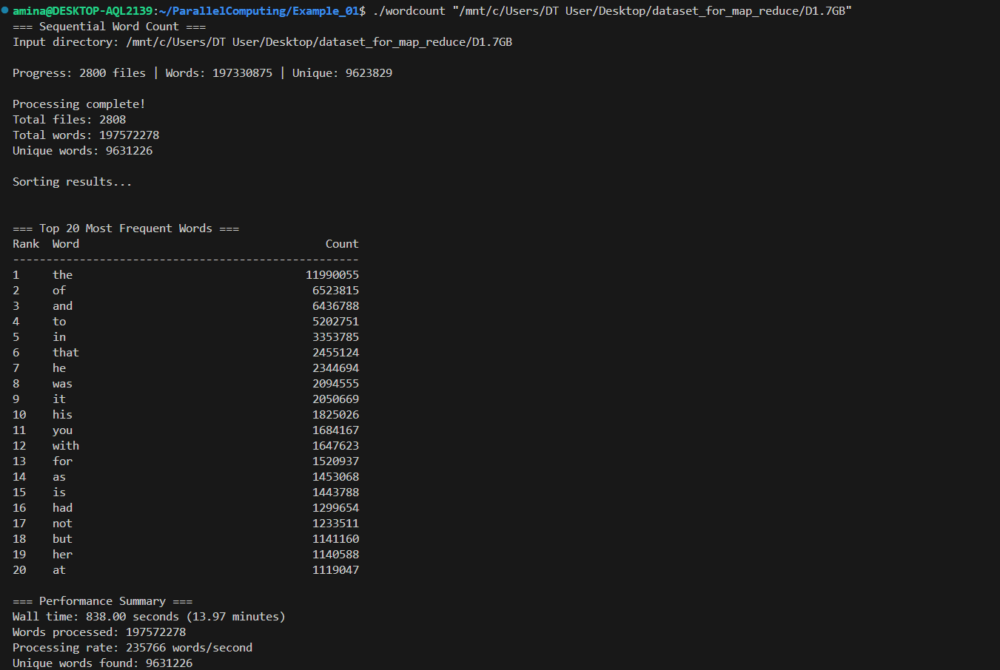
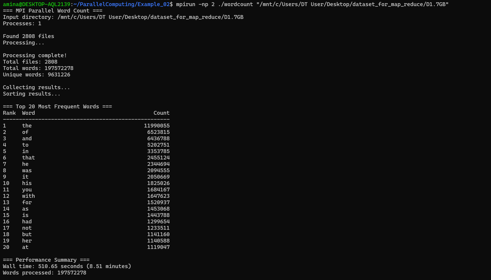
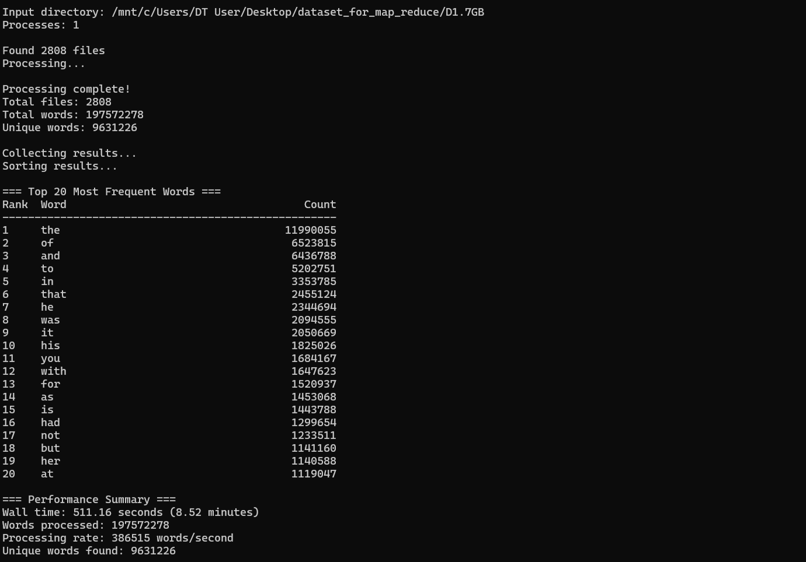
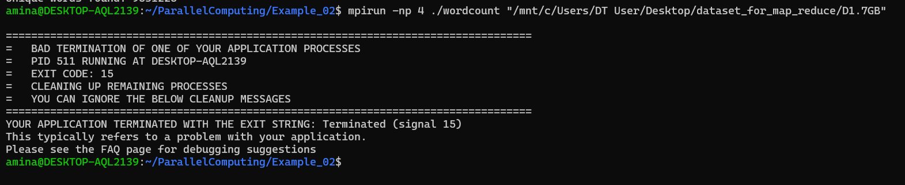

# ParallelComputing

Example_01

Example_02

Difference Between Sequential and Parallel Implementation

Sequential Implementation (Example_01)

Uses a single process to process all input files. Word grouping is done using a hash table, where each word is mapped to a bucket and its count is updated.Execution time increases linearly with dataset size.

Parallel Implementation (Example_02)

Uses MPI to distribute work across multiple processes. The dataset is divided among MPI processes, allowing the Map phase to run in parallel. Each process performs local word counting. Partial results are combined using MPI collective operations during the Reduce phase. This approach significantly reduces execution time for large datasets.

Parallel Execution with Different Numbers of Processes

The parallel MPI implementation was run only with 2 processes.

My laptop could not handle a higher number of processes. An attempt to run the program with 4 processes resulted in process termination: 

Because of these limitations, all valid parallel performance results in this assignment are based on 2 MPI processes.

Sequential vs Parallel Results Comparison

The parallel version achieves significantly faster execution.

Sequental = 838 seconds
Parallel = 511 seconds 

Hash Table vs Sorting for Shuffle/Grouping Phase

Using sorting instead of a hash table would increase execution time, especially for datasets with billions of words. Therefore, the hash-based approach is more suitable for this problem.

