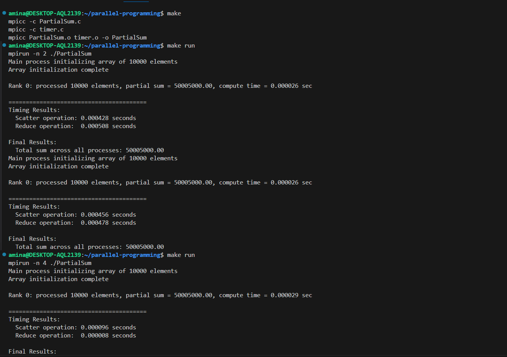
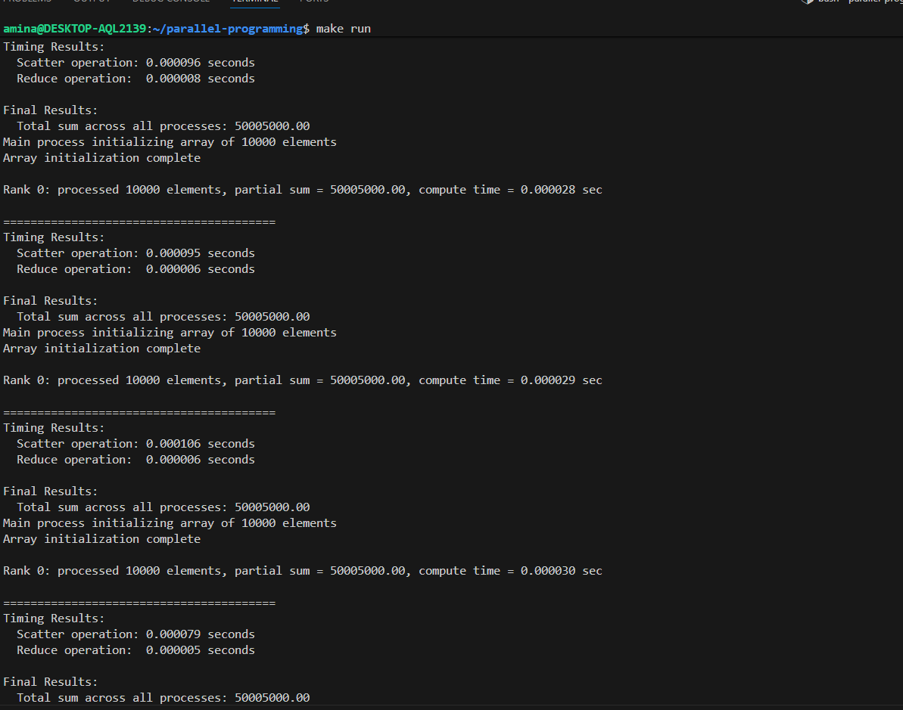
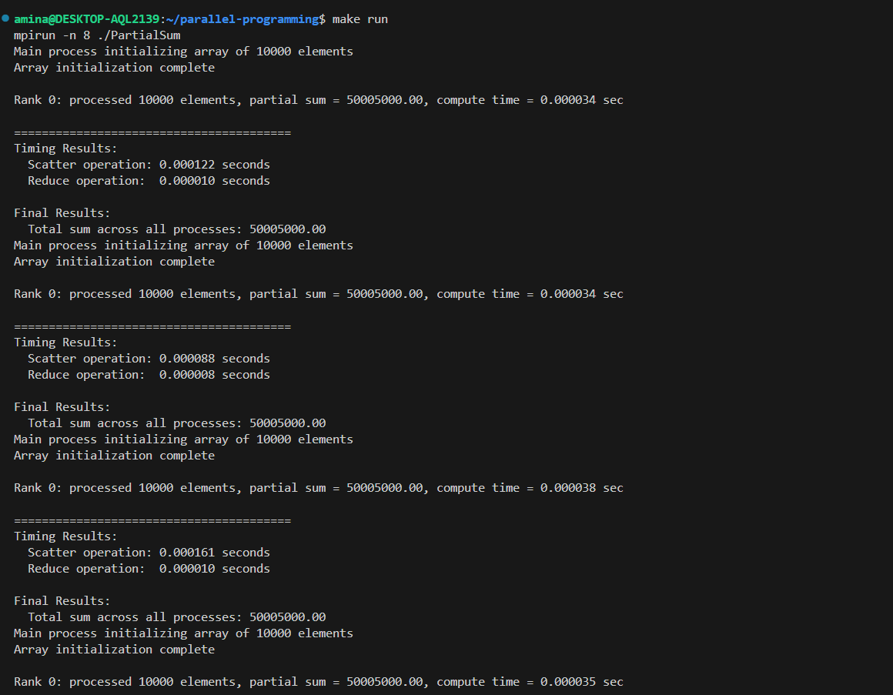
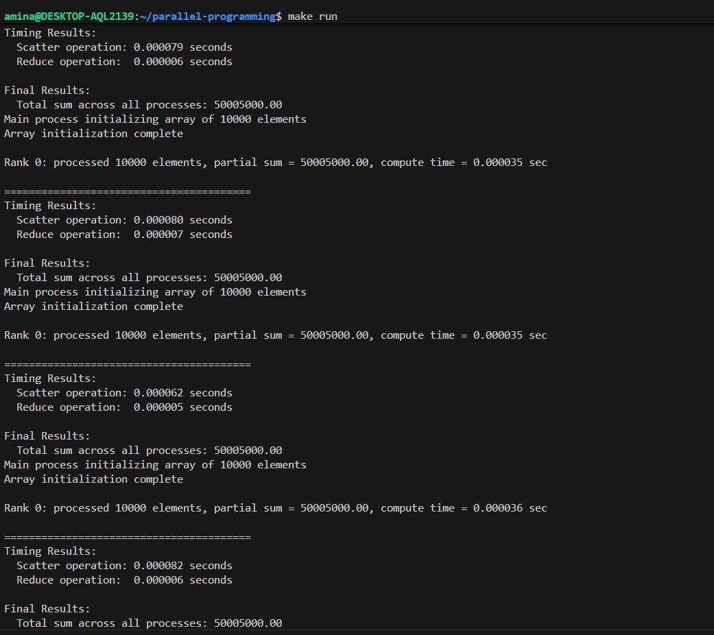

# parallel-programming

Description

The goal of this assignment was to complete the MPI code. The main task was to calculate the sum of an array that the main process allocates and initializes, using collective communication calls. The code was ran  with 2, 4, and 8 processes and measure the execution time for scatter and reduce operations.

The original template included MPI initialization, global array allocation (only on rank 0), and later, placeholder functions for scatter, reduce, and local sum.

Added Code 

- Calculating the size of each process's subproblem: additional code calculates the number of elements allocated to each process, and their starting and ending indices.

int base = ncells / nprocs;
int remainder = ncells % nprocs;
if (rank < remainder)
    nsize = base + 1;
else
    nsize = base;

int start = (rank < remainder)
            ? rank * (base + 1)
            : remainder * (base + 1) + (rank - remainder) * base;

int end = start + nsize - 1;

- For all process sizes with MPI_Allgather: extra code was added to send the size sent by each process.

MPI_Allgather(&nsize, 1, MPI_INT, nsizes, 1, MPI_INT, comm);

- The Scatterv offset is calculated so that the data for each process starts where it should in the array.

offsets[0] = 0;
for (int i = 1; i < nprocs; i++) {
    offsets[i] = offsets[i - 1] + nsizes[i - 1];
}

- Local array allocation: space allocated for each process's part of array.

double *a_local = (double *)malloc(nsize * sizeof(double));

- The final piece of the MPI C code adds up the local sums to give a global total in rank 0.

MPI_Reduce(&local_sum, &total_sum, 1, MPI_DOUBLE, MPI_SUM, 0, comm);

Results 

The program was run with different numbers of processes. The total sum is always the same (50005000.00), which confirms that the calculation is correct.
On my PC, running with 2, 4, and 8 processes worked fine, because it has enough cores.

