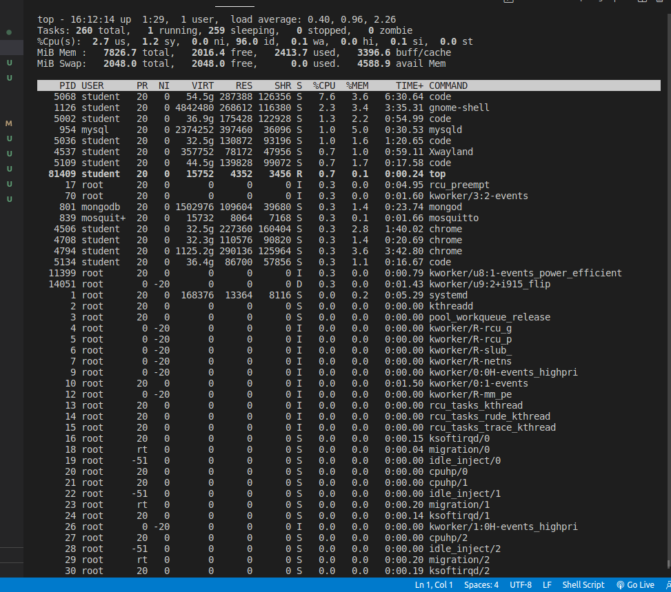
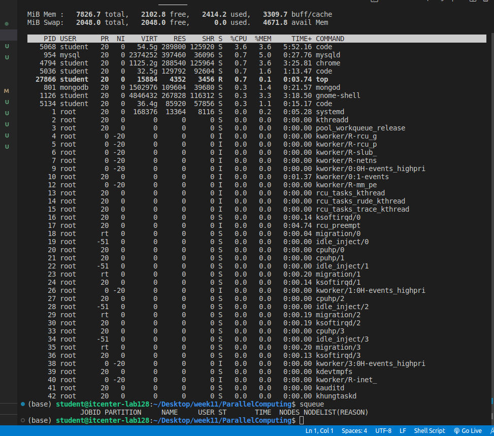
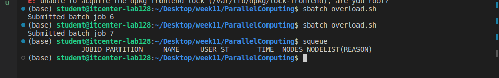
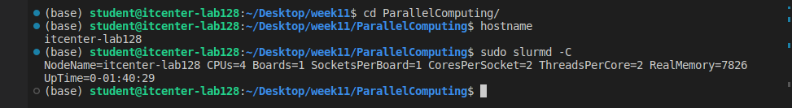
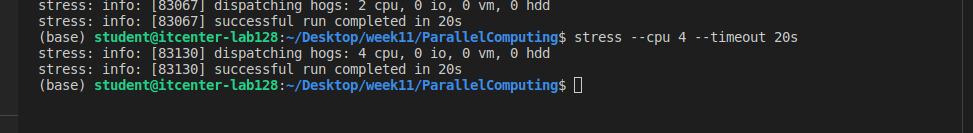
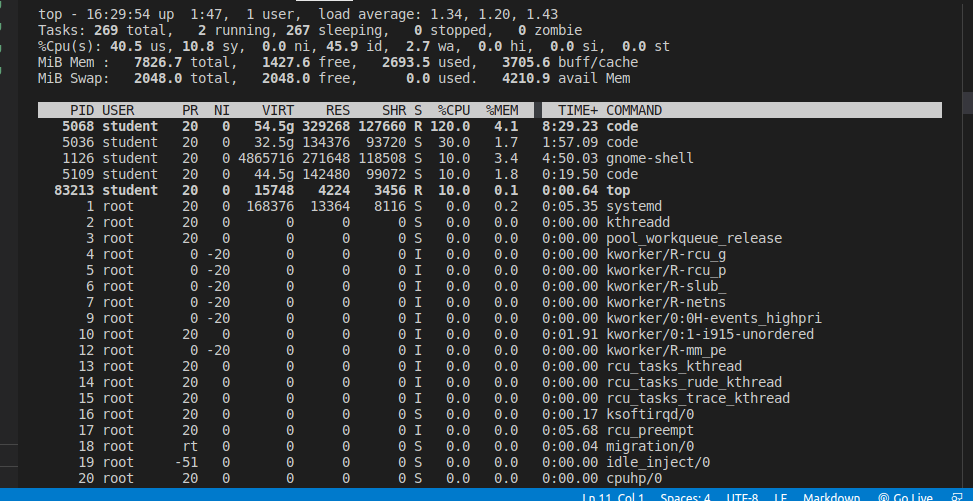

# ParallelComputing

The results show that Slurm successfully enforced the resource limits. Even if a user tries to run a heavy task with many threads, Slurm ensures they only use what they were officially granted. This is why the stress test finished successfully, but it didn't slow down my whole computer.

